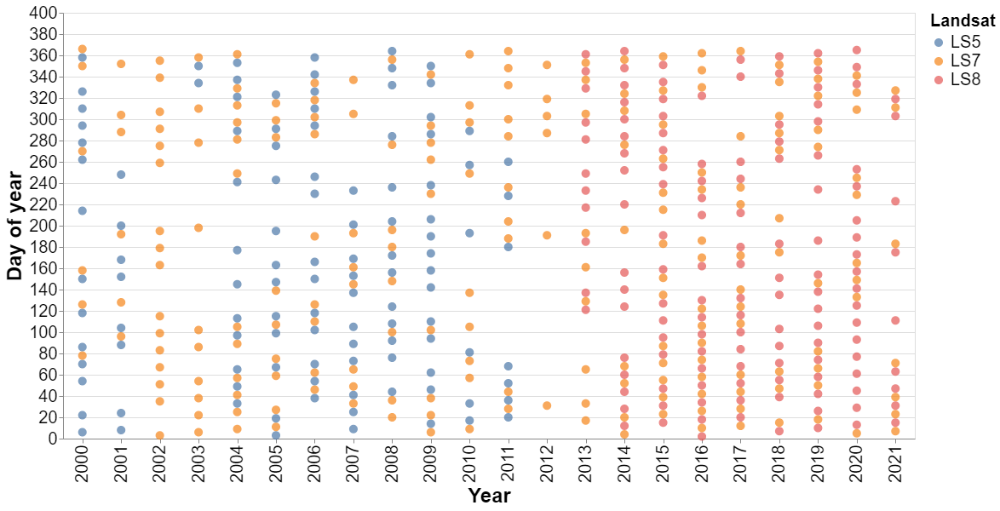
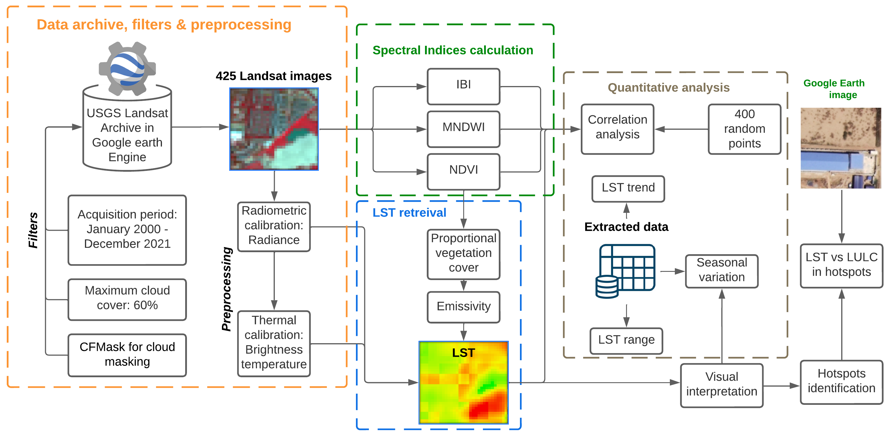

# Spatiotemporal Analysis of Land Surface Temperature in Response to Land Use and Land Cover Changes: A Remote Sensing Approach

***[Gulam Mohiuddin](https://www.linkedin.com/in/mohigeo33/)***, ***Jan-Peter Mund***

## 1. About the study
Rapid urbanisation in the global south has often introduced substantial and rapid uncontrolled Land Use 
and Land Cover changes (LULC), considerably affecting the Land Surface Temperature (LST) patterns. 
Understanding the relationship between LULC changes and LST is essential to mitigate such effects, 
considering the urban heat island (UHI). This study aims to elucidate the spatiotemporal variations 
and alterations of LST in urban areas compared to LULC changes. The study focused on a peripheral urban 
area of Phnom Penh (Cambodia) undergoing rapid urban development. Using Landsat images from 2000 to 2021, 
the analysis employed an exploratory time-series analysis of LST. The study revealed noticeable variability 
in LST (20 to 69°C), predominantly influenced by seasonal variability and LULC changes. The study also 
provided insights into how LST varies within different LULCs at the exact spatial locations. These changes
in LST did not manifest uniformly but displayed site-specific responses to LULC changes. This study accounts
for changing land surfaces' complex physical energy interaction over time. The methodology offers a replicable 
model for other similarly structured, rapidly urbanised regions utilising novel semi-automatic processing of LST 
from Landsat images, potentially inspiring future research in various urban planning and monitoring contexts.

## 2. Citation

Mohiuddin, G.; Mund, J.-P. Spatiotemporal Analysis of Land Surface Temperature in Response to Land Use and Land Cover Changes: A Remote Sensing Approach. Remote Sens. 2024, 16, 1286. https://doi.org/10.3390/rs16071286

## 3. Remote sensing data used in the study
We used collection-1: Tier 1 data from Landsat 5, 7 and 8. Both surface reflectance (SR)
and top-of-atmosphere (TOA) data via Google Earth Engine image archive data are provided 
by the NASA/USGS Landsat program. The images in the study area are highly susceptible to 
the presence of clouds. Hence, a maximum of 60% cloud filter is applied. Each dot represents 
an image that was considered for this study. After applying the cloud filter, 425 images from
2000 to 2021 were selected for the study (Figure 1).



Figure 1: Distribution of selected 425 images based on the day of the year and Landsat satellite type.

## 4. Study area

Chbar Ampov District, located in the southeast region of Phnom Penh, Cambodia, is a rapidly developing urban area 
with a mix of residential and commercial zones. The Mekong River borders the district from the north, the Meanchey 
District to the west, the Kien Svay District to the east and the Bassac River to the south.


Figure 2: Location of the study area


## 5. LST estimation and spectral indices calculation
The following steps were taken to estimate the LST and calculate the spectral indices from Landsat images (Figure 4)


Figure 3: Graphical overview of the methodical overview.

## 6. Highlighted results

Figure 4: [Calendar heatmaps of Mean LST](https://mohigeo33.github.io/lst_timeseries/calendar_MeanLST.html). (Click on the link to view the interactive chart)

Figure 5: [Calendar heatmaps of Maximum LST](https://mohigeo33.github.io/lst_timeseries/calendar_MaxLST.html). (Click on the link to view the interactive chart)

Figure 6: [Calendar heatmaps of Minimum LST](https://mohigeo33.github.io/lst_timeseries/calendar_MinLST.html). (Click on the link to view the interactive chart)

## 7. Notebook (Code) files and their description
lst_time_series.py: Image pre-processing, Spectral indices calculation, LST estimation and statistical data extraction

Prerequisites:
```python
import ee
ee.Initialize(project='YourProjectName')
```

User input:
```python
# study period
year_start = 2000
year_end = 2021
month_start = 1
month_end = 12

# temperature threshold
t_threshold = 20

# cloud filter
max_cloud_cover = 60 # in percentage

#AOI
# add your study area here
```

## 8. Files needed to run the code externally (downloadable from the repository)
b) cor_point.csv: the CSV file required for performing the same correlation analysis as the study

## 9. Remarks
This code is created for research purposes. Upon use, please provide appropriate references:
Mohiuddin, G.; Mund, J.-P. Spatiotemporal Analysis of Land Surface Temperature in Response to Land Use and Land Cover Changes: A Remote Sensing Approach. Remote Sens. 2024, 16, 1286. https://doi.org/10.3390/rs16071286
