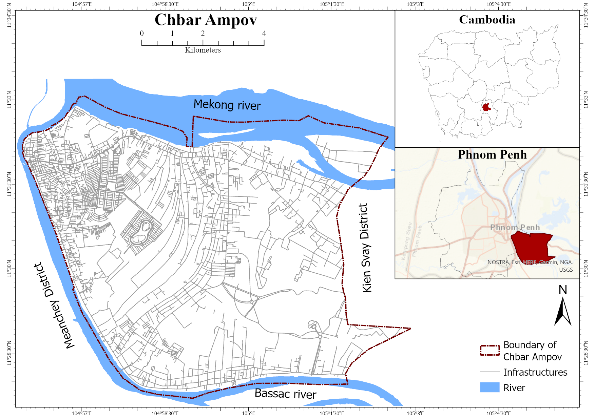

# Spatiotemporal Analysis of Land Surface Temperature in Re-sponse to Land Use and Land Cover Changes: A Remote Sens-ing Approach

***[Gulam Mohiuddin](https://www.linkedin.com/in/mohigeo33/)***, ***Jan-Peter Mund***

## 1. About the study
Rapid urbanisation in the global south has often introduced substantial and rapid uncontrolled Land Use and Land Cover changes (LULC), considerably affecting the Land Surface Temperature (LST) patterns. Understanding the relationship between LULC changes and LST is essential to mitigate such effects, considering the urban heat island (UHI). This study aims to elucidate the spatiotemporal variations and alterations of LST in urban areas compared to LULC changes. The study focused on a peripheral urban area of Phnom Penh (Cambodia) undergoing rapid urban development. Using Landsat images from 2000 to 2021, the analysis employed an exploratory time-series analysis of LST. The study revealed noticeable variability in LST (20 to 69°C), predom-inantly influenced by seasonal variability and LULC changes. The study also provided insights into how LST varies within different LULCs at the exact spatial locations. These changes in LST did not manifest uniformly but displayed site-specific responses to LULC changes. This study accounts for changing land surfaces' complex physical energy interaction over time. The methodology offers a replicable model for other similarly structured, rapidly urbanised regions utilising novel semi-automatic processing of LST from Landsat images, potentially inspiring future research in various urban planning and monitoring contexts.

## 2. Remote sensing data used on the study
The study primarily used the Landsat data for LST estimation and calculating different
spectral indices. This study used collection-1: Tier 1 data from Landsat 5, 7 and 8. Both
surface reflectance (SR) and calibrated top-of-atmosphere (TOA) data were used. The images 
in Phnom Penh is highly susceptible to the presence of cloud. Hence, a
maximum of 60% cloud filter is applied. The cloud coverage of the selected images is
presented in the following chart (Figure 1). Each dot represents an image that was
considered for this study. After applying the cloud filter, 462 images were found from
2000 to 2021

Figure 1: [Cloud coverage in the Landsat images selected for the study](https://mohigeo33.github.io/lst_timeseries/cloud_cover.html). (Click on the link to view the interactive chart)

Figure 2: Sensor-wise number of Landsat images for the period of 2000 to 2021 (60% maximum cloud filter applied)

## 3. Study area
Chbar Ampov District, located in the southeast region of Phnom Penh, Cambodia, is a rapidly developing urban area 
with a mix of residential and commercial zones (City of Phnom Penh, 2020). The Mekong River borders the district to 
the east, Meanchey District to the west, Kandal Province to the north, and Prek Pnov District to the south (Figure 3).

Figure 3: Location of the study area

## 4. LST estimation and spectral indices calculation
Following steps were taken to estimate the LST and calculate the spectral indices from Landsat images (Figure 4)

Figure 4: LST estimation and spectral indices calculation from Landsat images

## 5. Highlighted results

Figure 5: [Calendar heatmaps of Mean LST](https://mohigeo33.github.io/lst_timeseries/calendar_MeanLST.html). (Click on the link to view the interactive chart)

Figure 6: [Calendar heatmaps of Maximum LST](https://mohigeo33.github.io/lst_timeseries/calendar_MaxLST.html). (Click on the link to view the interactive chart)

Figure 7: [Calendar heatmaps of Minimum LST](https://mohigeo33.github.io/lst_timeseries/calendar_MinLST.html). (Click on the link to view the interactive chart)

Figure 8: Annual LST range (2000 - 2021)

Figure 9: Number of warmer months per year in LST categories
(The height of each bar represents the warmth score for respective years.)

Figure 10: [Total time series of minimum, mean & maximum LST (2000 - 2021)](https://mohigeo33.github.io/lst_timeseries/LST_trend.html). (Click on the link to view the interactive chart)

Figure 11: Correlation matrix between LST, IBI, MNDWI & NDVI

## 6. Notebook (Code) files and their description
a) LST_Calculation.ipynb: Image pre-processing, Spectral indices calculation, LST estimation and statistical data extraction

b) Statistical_analysis.ipynb: Descriptive statistics, trend and correlation analysis

## 7. Files needed to run the code externally (downloadable from the repository)
a) AOI.zip: the shapefile for area of interest

b) CSV files.zip: the csv files required for statistical analysis

## 8. Remarks
This code is created for research purposes. Upon use please provide appropriate references.
